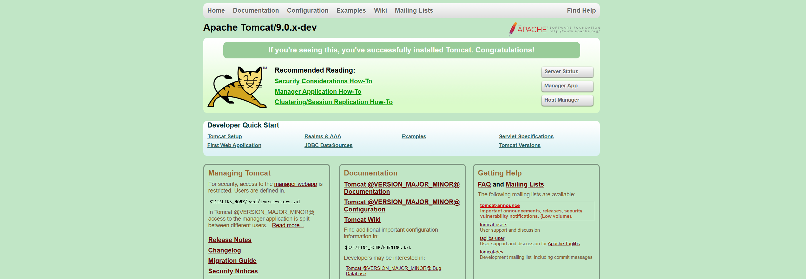

> 本文档如无特别说明，全都是基于 tomcat 9.0.43 版本

# 引言

## servlet-api 和 javax.servlet-api的区别
这两个构件都是 Servlet-Specification Jar （Servlet 规范包），只不过因为版本升级:

- 3.1 之前的 Servlet API 构件叫做 servlet-api-xxx.jar
- 3.1 及之后的Servlet API 构件改名为 javax.servlet-api-xxx.jar

## Tomcat安装

### 目录结构


### 源码编译


1.创建源码运行的home目录，我在源码最外层创建了名为catalina-home的home目录。（这个目录的位置及命名规则可以任意）

2.将源码目录下的webapps及conf这两个文件夹移到到源码运行的home目录下，即移到到catalina-home目录下，最后效果如下图所示。（多余的logs文件和work文件是在tomcat运行后自动生成的）


3.在tomcat最外层目录新建pom.xml文件
（1）将tomcat源码项目改为maven工程
（2）用作引入编译tomcat源码时缺少的依赖

pom.xml文件内容如下（文件中的tomcat版本相关信息可以自定义，例如9.0.x可以替换为自己使用的源码版本）：

```xml
<?xml version="1.0" encoding="UTF-8"?>
<project xmlns="http://maven.apache.org/POM/4.0.0"
         xmlns:xsi="http://www.w3.org/2001/XMLSchema-instance"
         xsi:schemaLocation="http://maven.apache.org/POM/4.0.0 http://maven.apache.org/xsd/maven-4.0.0.xsd">

    <modelVersion>4.0.0</modelVersion>
    <groupId>org.apache.tomcat</groupId>
    <artifactId>Tomcat9.0.x</artifactId>
    <name>Tomcat9.0.x</name>
    <version>9.0.x</version>

    <build>
        <finalName>Tomcat9.0.x</finalName>
        <sourceDirectory>java</sourceDirectory>
        <resources>
            <resource>
                <directory>java</directory>
            </resource>
        </resources>
        <plugins>
            <plugin>
                <groupId>org.apache.maven.plugins</groupId>
                <artifactId>maven-compiler-plugin</artifactId>
                <version>2.3</version>
                <configuration>
                    <encoding>UTF-8</encoding>
                    <source>1.8</source>
                    <target>1.8</target>
                </configuration>
            </plugin>
        </plugins>
    </build>

    <dependencies>
        <dependency>
            <groupId>org.apache.ant</groupId>
            <artifactId>ant</artifactId>
            <version>1.10.1</version>
        </dependency>
        <dependency>
            <groupId>org.apache.ant</groupId>
            <artifactId>ant-apache-log4j</artifactId>
            <version>1.9.5</version>
        </dependency>
        <dependency>
            <groupId>org.apache.ant</groupId>
            <artifactId>ant-commons-logging</artifactId>
            <version>1.9.5</version>
        </dependency>
        <dependency>
            <groupId>javax.xml.rpc</groupId>
            <artifactId>javax.xml.rpc-api</artifactId>
            <version>1.1</version>
        </dependency>
        <dependency>
            <groupId>wsdl4j</groupId>
            <artifactId>wsdl4j</artifactId>
            <version>1.6.2</version>
        </dependency>
        <dependency>
            <groupId>org.eclipse.jdt.core.compiler</groupId>
            <artifactId>ecj</artifactId>
            <version>4.6.1</version>
        </dependency>
        <dependency>
            <groupId>junit</groupId>
            <artifactId>junit</artifactId>
            <version>4.12</version>
            <scope>test</scope>
        </dependency>
        <dependency>
            <groupId>org.easymock</groupId>
            <artifactId>easymock</artifactId>
            <version>3.5.1</version>
            <scope>test</scope>
        </dependency>
        <dependency>
            <groupId>biz.aQute.bnd</groupId>
            <artifactId>biz.aQute.bndlib</artifactId>
            <version>5.2.0</version>
            <scope>provided</scope>
        </dependency>
    </dependencies>
</project>
```

4.启动tomcat，tomcat的启动类是`org.apache.catalina.startup.Bootstrap`

配置启动类，启动时需要指定启动参数（VM options）

```properties
-Dcatalina.home=catalina-home
-Dcatalina.base=catalina-home
-Djava.endorsed.dirs=catalina-home/endorsed
-Djava.io.tmpdir=catalina-home/temp
-Djava.util.logging.manager=org.apache.juli.ClassLoaderLogManager
-Djava.util.logging.config.file=catalina-home/conf/logging.properties
```


5.最后运行启动类

看见下面相关日志表示tomcat源码启动成功


访问`http://localhost:8080`，看到下图页面也表示tomcat源码启动成功



# Tomcat总体架构

## 浏览器访问服务器的流程

## Tomcat总体架构


​	


​	tomcat在官网上介绍是一款Servlet容器，实现了JavaEE中的众多规范。


### coyote


### catalina


## Tomcat组件介绍


### Server


### Service


# Tomcat启动流程


# Tomcat请求处理流程


# 核⼼配置详解


## Tomcat服务器配置

问题⼀：去哪⼉配置？ 核⼼配置在tomcat⽬录下conf/server.xml⽂件

问题⼆：怎么配置？

注意：

 - Tomcat 作为服务器的配置，主要是 server.xml ⽂件的配置；
 - server.xml中包含了 Servlet容器的相关配置，即 Catalina 的配置；
 - Xml ⽂件的讲解主要是标签的使⽤

整体标签结构如下：
```xml
<!--
Server 根元素，创建⼀个Server实例，⼦标签有 Listener、GlobalNamingResources、
Service
-->
<Server>
    <!--定义监听器-->
    <Listener/>
    <!--定义服务器的全局JNDI资源 -->
    <GlobalNamingResources/>
    <!-- 定义⼀个Service服务，⼀个Server标签可以有多个Service服务实例 -->
    <Service/>
</Server>
```


## Web应用配置


## JVM配置


# Tomcat性能优化

